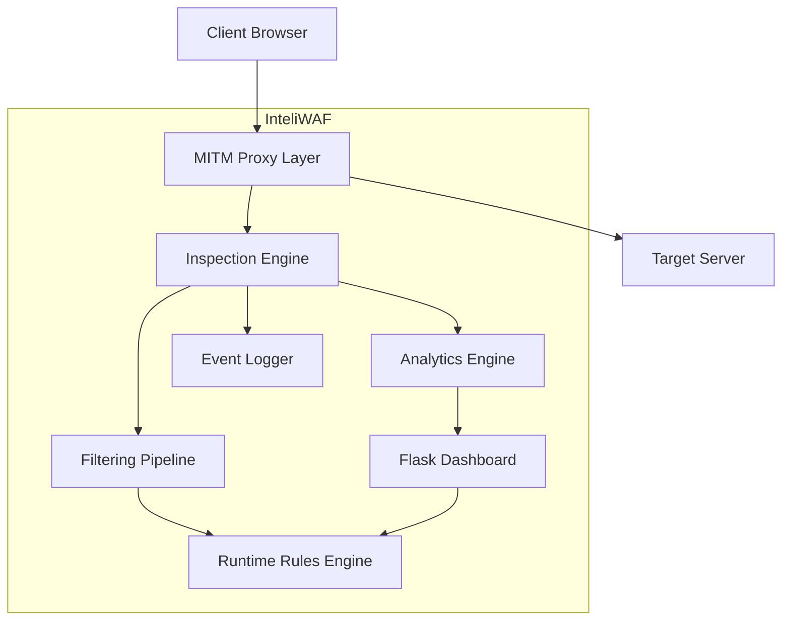

<div align="center">

# 🛡️ InteliWAF

### *Real-time HTTP Traffic Analysis & Threat Detection Platform built with Python, Flask, and mitmproxy*


[](https://python.org)
[](https://flask.palletsprojects.com)
[](https://mitmproxy.org)
[](https://postgresql.org)
[](https://owasp.org/www-project-top-ten/)
[](https://docker.com)
[](https://kubernetes.io))

## 📹 Demo Video

[](https://youtu.be/yMJc3awMF4E)

Click the image to watch the demo on YouTube

**Protect your web applications from OWASP Top 10 attacks with real-time monitoring and automated response**


[Features](#-features) • [Quick Start](#-quick-start) • [Architecture](#-architecture) • [API Documentation](#-api-documentation) • [Contributing](#-contributing)

</div>

---

# 📋 Table of Contents

- [Overview](#-overview)
- [Features](#-features)
- [Adaptive Filtering Engine](#-Adaptive_Filtering_Engine)
- [Enterprise_Dashboard](#-Enterprise_Dashboard)
- [Architecture](#-Architecture)
- [Project Structure](#-project-structure)
- [Quick Start](#-quick-start)
- [Configuration](#-configuration)
- [Running InteliWAF](#-running-InteliWAF)
- [Dashboard](#-dashboard)
- [API Documentation](#-api-documentation)
- [Future Enhancements](#-future-enhancements)
- [Contributing](#-contributing)
- [License](#-license)

---

# 🎯 Overview

**InteliWAF** is a modular real-time traffic inspection and analytics platform designed to intercept, inspect, classify, and monitor HTTP traffic flowing through a proxy layer Built with Python, Flask and REST API it provides enterprise-grade security with an intuitive dashboard for security teams..

The system combines:

- MITM-based traffic interception
- Request inspection pipelines
- Adaptive filtering mechanisms
- Real-time analytics dashboards
- Runtime firewall configuration
- Lightweight logging architecture

InteliWAF was designed with scalability and modularity in mind, making it suitable for experimentation with traffic engineering, security analytics, request classification, and backend monitoring systems.

---

# ✨ Features

## Real-time Traffic Inspection

- HTTP request interception using mitmproxy
- Payload normalization pipeline
- Multi-layer request inspection
- Live traffic event processing

---

# 🛡️ Adaptive_Filtering_Engine

- Sliding-window rate limiting
- Brute-force detection
- Request pattern analysis
- Runtime-configurable filtering rules
- Port access management

---

## 📊 Enterprise_Dashboard

- Real-time traffic monitoring
- Attack/event visualization
- Live request feed
- Traffic distribution analytics
- Interactive Chart.js dashboards

---

# 🏗️ Architecture

- Separated detection engine
- Config-driven firewall rules
- Lightweight event logging
- Independent analytics pipeline
- Extensible inspection modules

---

# 🏗️ System Architecture



---

# ⚙️ Engineering Highlights

- Real-time request processing pipeline
- Sliding-window rate limiting algorithm
- Entropy-based payload analysis
- Request normalization engine
- Modular inspection architecture
- Runtime firewall configuration
- Lightweight CSV-based event logging
- Interactive analytics visualization

---

# 📁 Project Structure

```bash
InteliWAF/
│
├── app.py
├── mitm_waf.py
├── attacks.py
├── db.py
├── firewall_config.json
├── traffic_events.csv
│
├── templates/
│   ├── dashboard.html
│   ├── login.html
│   └── control.html
│
├── screenshots/
│
├── requirements.txt
├── README.md
└── LICENSE
```

---

---

# 🚀 Quick Start

## 📌 Prerequisites

```bash
Python 3.8+
PostgreSQL 14+
Git
pip
```

---

## 1️⃣ Clone Repository

```bash
https://github.com/rutikavhad/InteliWFA_Web_Dashboard_-_Control_Panel

cd InteliWFA_Web_Dashboard_-_Control_Panel
```

---

## 2️⃣ Create Virtual Environment

### Linux / macOS

```bash
python -m venv venv
source venv/bin/activate
```

### Windows

```bash
python -m venv venv

venv\Scripts\activate
```

---

## 3️⃣ Install Dependencies

```bash
pip install flask psycopg2-binary mitmproxy
```

Or using requirements.txt:

```bash
pip install -r requirements.txt
```

---

# 🗄️ Database Setup

## Login to PostgreSQL

```bash
sudo -u postgres psql
```

## Create Database & User

```sql
CREATE DATABASE InteliWAF;

CREATE USER waf_admin WITH PASSWORD 'admin123';

GRANT ALL PRIVILEGES ON DATABASE InteliWFA TO waf_admin;
```

Exit PostgreSQL:

```sql
\q
```

---

## Create Admin Table

```bash
psql -U waf_admin -d InteliWAF -c "

CREATE TABLE IF NOT EXISTS admin (
    id SERIAL PRIMARY KEY,
    email VARCHAR(100) UNIQUE NOT NULL,
    password VARCHAR(255) NOT NULL
);

INSERT INTO admin (email, password)
VALUES (
    'admin',
    '1234'
)
ON CONFLICT (email) DO NOTHING;
"
```

---

# ⚙️ Configuration

## Database Configuration

Create `db.py`

```python
import psycopg2

def get_connection():
    return psycopg2.connect(
        host="localhost",
        database="InteliWAF",
        user="waf_admin",
        password="admin123"
    )
```

---

# ▶️ Running InteliWAF

## Start Flask Dashboard

```bash
python app.py
```

Dashboard URL:

```bash
http://127.0.0.1:5000
```

---

## Start MITM WAF Proxy

```bash
mitmdump -s mitm_waf.py -p 8080
```

---

## Configure Browser Proxy

| Setting | Value     |
| ------- | --------- |
| Host    | 127.0.0.1 |
| Port    | 8080      |


# 🔍 Dashboard Features

The analytics dashboard includes:

- Live traffic monitoring
- Traffic classification charts
- Event analytics
- Request trend visualization
- Runtime firewall controls
- Port management system

---

# Configuration

InteliWAF uses a lightweight JSON-based configuration system.

Example:

```json
{
    "firewall_enabled": true,
    "blocked_ports": [22, 23, 3389, 445],
    "allowed_ports": [80, 443, 8080, 3000, 5000]
}
```

---

# 📊 Dashboard

The SentinelFlow dashboard provides:

    ✅ Live traffic feed
    ✅ Attack statistics
    ✅ Pie chart visualization
    ✅ Attacks per minute graph
    ✅ 24-hour analytics
    ✅ Firewall toggle controls
    ✅ Port management system

---


# 🔌 API Documentation

## Get Analytics Data

```http
GET /api/stats
```

---

## Toggle Firewall

```http
POST /api/firewall/toggle
```

---

## Update Port Rules

```http
POST /api/firewall/ports
```

---

# 🚀 Performance

| Metric | Value |
|--------|-------|
| Real-time Processing | Yes |
| Detection Pipeline | Multi-layer |
| Dashboard Refresh | 3 seconds |
| Request Logging | Live |
| Memory Footprint | Lightweight |
| Architecture | Modular |

---

# Scalability Roadmap

# 🔮 Future Enhancements

- Redis-backed rate limiting
- Kafka event streaming
- WebSocket live updates
- Elasticsearch analytics
- Docker deployment
- Kubernetes orchestration
- Async request processing
- Distributed inspection nodes

---

# Screenshots

## Analytics Dashboard

```text
Add screenshots here:

screenshots/dashboard.png
screenshots/Control_page.png
screenshots/block.png
```

---

# Development Goals

InteliWAF was built to explore:

- Real-time request processing
- Backend system design
- Traffic inspection pipelines
- Event-driven analytics
- Runtime configuration systems
- Monitoring dashboards
- Modular backend architecture

---

# 🤝 Contributing

Contributions are welcome!

## Steps

1. Fork the repository
2. Create a new branch

```bash
git checkout -b feature-name
```

3. Commit changes

```bash
git commit -m "Added new feature"
```

4. Push branch

```bash
git push origin feature-name
```

5. Open Pull Request

---

# 🛠️ Tech Stack

| Technology  | Purpose                 |
| ----------- | ----------------------- |
| Python      | Backend logic           |
| Flask       | Dashboard web framework |
| mitmproxy   | HTTP/HTTPS interception |
| PostgreSQL  | Authentication database |
| Chart.js    | Analytics visualization |
| HTML/CSS/JS | Frontend dashboard      |

---

# 📜 License

This project is licensed under the MIT License.

```text
MIT License

Copyright (c) 2026 SentinelFlow

Permission is hereby granted, free of charge,
to any person obtaining a copy of this software...
```

---

<div align="center">

## ⭐ Support the Project

If you like SentinelFlow, give it a ⭐ on GitHub!

Made with ❤️ using Python & Flask

</div>
```
# InteliWFA_Web_Dashboard_-_Control_Panel
